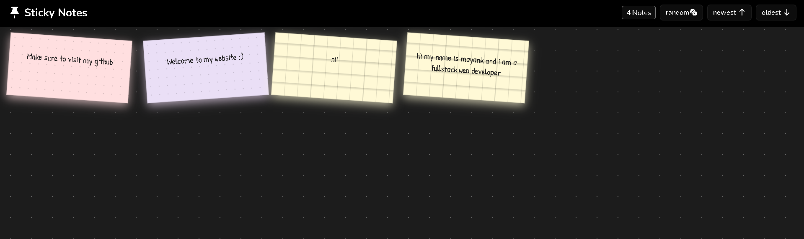

# 📌 Sticky Notes

A lightweight, fully client-side sticky notes web app — no backend, no accounts, no installs. Just open it and start pinning your thoughts to the wall.



---

## ✨ Features

- **Persistent notes** — notes survive page refreshes via `localStorage`
- **6 pastel color themes** — Cream, Blush, Mist, Sage, Lilac, Wheat
- **5 paper styles** — Lined, Plain, Graph, Dotted, Dark
- **Random tilt** — every card gets a subtle hand-pinned rotation
- **Sort & shuffle** — order notes by newest, oldest, or random
- **120 character limit** per note with live character counter
- **Smooth animations** — panel slides in, falls away on close
- **Fully responsive** — works great on mobile, tablet, and desktop

---

## 🚀 Getting Started

No build tools or dependencies needed.

```bash
git clone https://github.com/Mayanksharma3012/Sticky-notes.git
cd Sticky-notes
```

Then just open `index.html` in your browser — that's it.

> Or use the VS Code **Live Server** extension for hot reload during development.

---

## 📁 Project Structure

```
sticky-notes/
├── index.html      # Markup and layout
├── style.css       # All styling and responsive breakpoints
└── script.js       # App logic, localStorage, sorting
```

---

## 🎨 How to Use

| Action | How |
|---|---|
| Create a note | Click the **+** button (bottom right) |
| Pick a color | Select a color dot in the panel |
| Pick a style | Select a paper style swatch |
| Post the note | Click **Post It** |
| Close the panel | Click **Cancel** or click anywhere outside |
| Sort notes | Use **Newest** / **Oldest** buttons in the header |
| Shuffle notes | Click the **Random** button |
| Clear all notes | Run `localStorage.clear(); location.reload();` in the browser console |

---

## 🛠️ Built With

- **Vanilla HTML, CSS & JavaScript** — zero frameworks, zero dependencies
- **[Google Fonts](https://fonts.google.com/)** — Nunito + Patrick Hand
- **[Font Awesome 7](https://fontawesome.com/)** — icons
- **localStorage API** — client-side persistence

---

## 📱 Responsive Breakpoints

| Screen | Cards per row |
|---|---|
| Desktop (> 1100px) | 6 |
| Tablet landscape (≤ 1100px) | 4 |
| Tablet portrait (≤ 768px) | 3 |
| Mobile (≤ 480px) | 2 |
| Small phones (≤ 360px) | 1 |

---

## 📄 License

MIT — do whatever you want with it.

---

Made by [Mayank](https://mayanksharma3012.github.io/Sticky-notes/)
